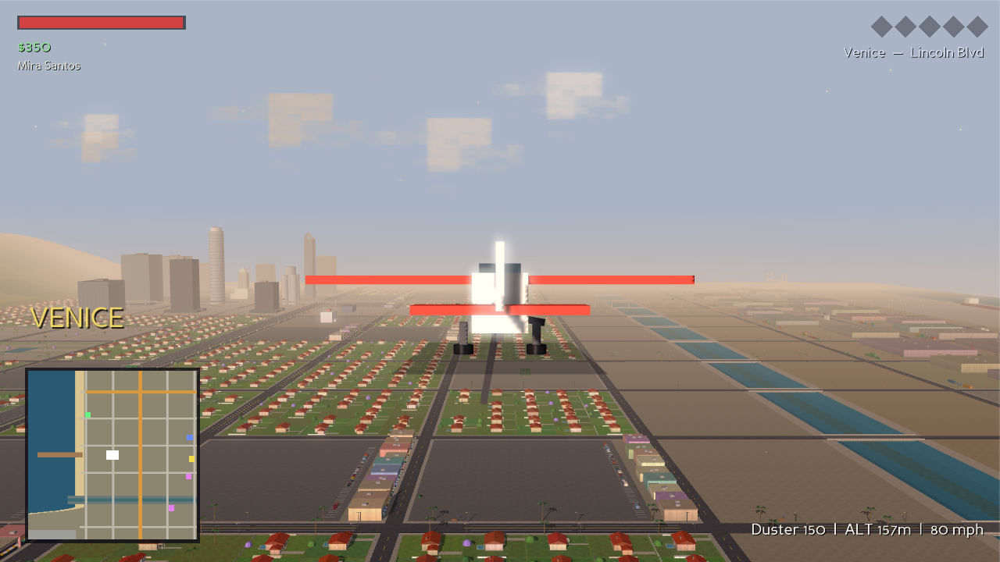
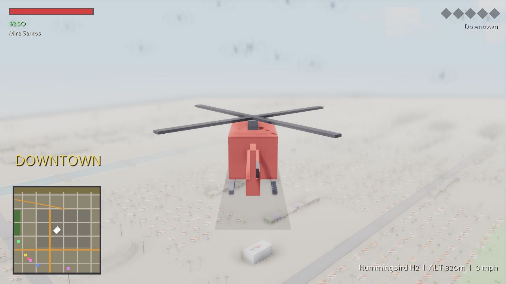
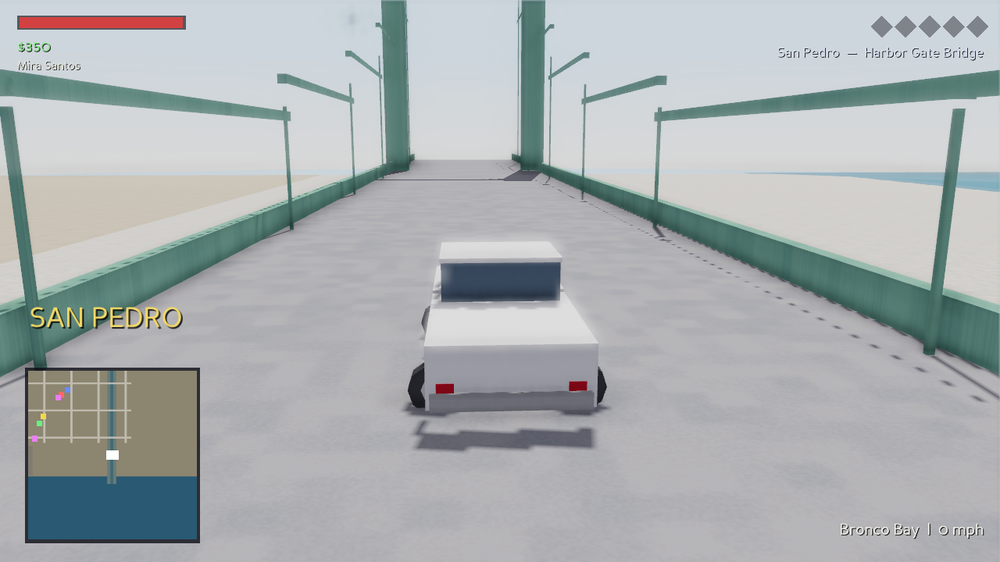
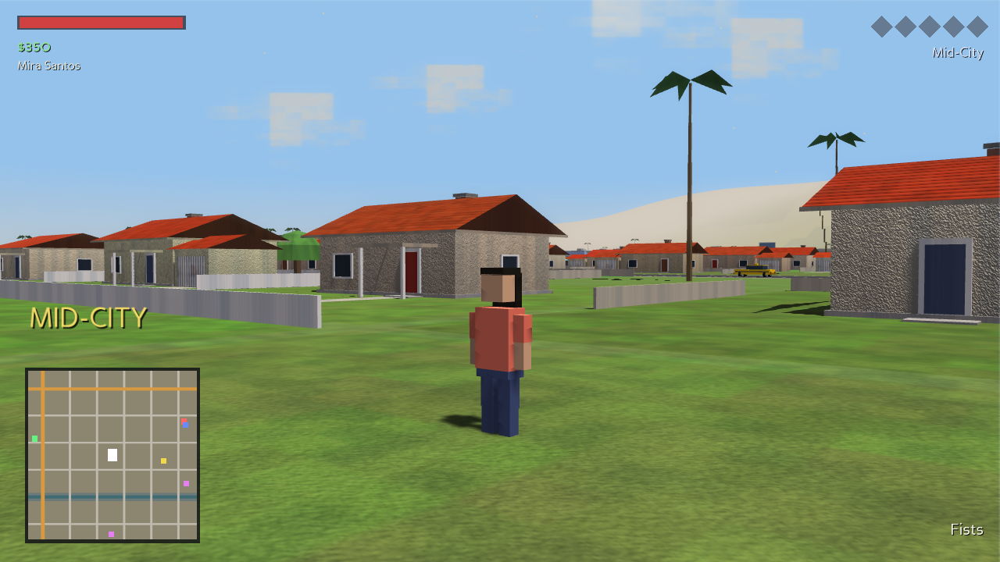
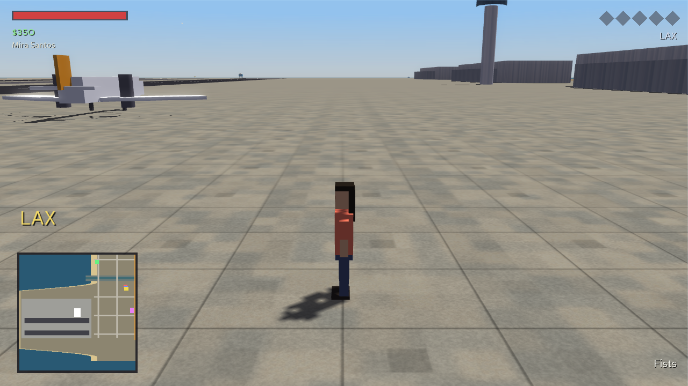
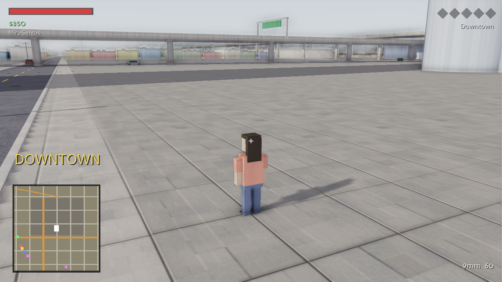
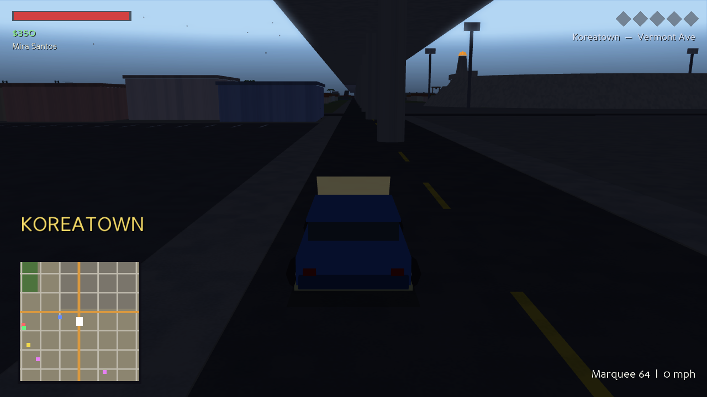

# ANGEL CITY

An original open-world driving / flying / action sandbox set in a **miniature Los
Angeles** — a native 3D executable game (Panda3D), no browser required. Every mesh,
texture, sound, and character in the game is **generated procedurally in code**: the
repo contains zero asset files, and the whole world is built from scratch at launch in
a few seconds.



## A faithful-topology Los Angeles

The map is a compressed but geographically honest LA, laid out like the real city:

- **Freeways with real topology** — the elevated **Santa Monica Fwy (10)** running
  east–west on columns, the elevated **Harbor Fwy (110)** crossing above it and running
  south to San Pedro, the at-grade **San Diego Fwy (405)** on the west side, and the
  **Hollywood Fwy (101)** climbing diagonally into the hills — all drivable, with
  on/off-ramps, gantry signs, and their own ambient traffic.
- **Real street names** on the arterial grid: Sunset, Wilshire, Pico, Ocean Ave,
  Lincoln, Sepulveda, La Cienega, Fairfax, La Brea, Crenshaw, Western, Vermont,
  Figueroa, Alameda… the HUD shows your current neighborhood and street.
- **Real neighborhoods in the right places** — Venice and Santa Monica on the sand,
  Hollywood under the hills, Downtown's tower cluster east of center, Koreatown,
  Inglewood, South Central, Vernon's warehouses, the harbor at San Pedro.
- **Landmarks** (original low-poly stand-ins at true relative positions): the
  HOLLYWOOD sign, a Griffith-style observatory, City-Hall and US-Bank-style towers, a
  round record-company tower, a hillside amphitheater, two stadiums, the Santa-Monica
  pier with a working Ferris wheel, **LAX** with two runways / terminals / theme
  building, the concrete **LA River** and Ballona Creek channels (drivable!), port
  cranes, a green suspension bridge over the river mouth, nodding oil pumpjacks, a
  giant rooftop donut, and palm trees everywhere.




## Features

- **On foot** — third-person movement, jumping, punching, mouse-look aiming
- **Swappable characters** — press `C` to cycle 12 playable Angelenos mid-game
- **Cars** — 8 original models (sedan, sports coupe, lowrider, pickup, van, taxi,
  police cruiser, beater) with arcade drift physics, damage, explosions
- **Aircraft** — a prop plane and a business jet (take off from LAX), plus a
  **helicopter** that can land on rooftop helipads (hospital, the Crown tower)
- **Boats** — speedboats moored at the marina; the bay, harbor, and river are open water
- **Guns** — pistol / SMG / shotgun with hitscan, tracers, pickups, and an ammo shop
- **Living city** — lane-following traffic that stops at working **traffic lights**,
  pedestrians who flee, carjackable drivers, parked cars everywhere
- **Wanted system** — 5 stars, pursuing cruisers, officers on foot, busts, hospital
  respawns, and Auto Spa respray shops to lose the heat
- **Day/night cycle** — LA-smog sunsets, stars, lit tower windows, street-lamp pools,
  headlights, runway lights at night
- **Fully procedural audio** — engines (pitch tracks speed), helicopter rotor, prop
  and jet noise, sirens, skids, gunshots, horns, crashes, waves at the shore — all
  synthesized with numpy at first launch
- Minimap + full city map (`M`) with labeled landmarks

## Graphics

The renderer runs a modern pipeline — with every texture still generated in code:

- **Per-pixel lighting** with a **real-time 4096px sun shadow map** whose frustum
  follows the player, so towers, palms, lampposts, cars, and you all cast true shadows
- **A full procedural material library**: asphalt with cracks and patches, concrete
  sidewalk slabs with expansion joints, terracotta roof-tile courses, stucco, rusty
  corrugated metal, grass, rippled sand — each surface class in the whole city carries
  its own texture (walls and roofs are UV-mapped at build time so ribs and tile
  courses run the right way)
- **Dressed buildings everywhere**: houses with framed windows, doors, porches,
  chimneys, eave fascia, garages with ribbed doors, driveways, picket fences and
  pools; storefronts with mullioned glass, striped awnings, and named sign boards;
  towers with dark-glass lobbies, entrance canopies, and rooftop water tanks and
  penthouses; warehouses with roll-up doors and pipework — plus baked contact
  shadows under every structure
- **A living streetscape**: curbs, zebra crosswalks, stop lines, lane arrows,
  manholes, fire hydrants, parking meters, bus benches, wood power poles with sagging
  lines, and freeway billboards running original ads
- **Real dynamic lights at night**: the player car casts true spotlight headlight
  beams, and pursuing police carry a flashing red/blue strobe light
- **Tangent-space normal maps on every material** (stucco grain, sidewalk joints,
  roof-tile courses, corrugation ribs, asphalt aggregate, sand ripples, facade
  mullions) with per-material specular response — matte stucco to glossy curtain wall
- **A real solar model**: the sun follows the true Los Angeles sky path (34.05°N,
  June 21 ephemeris) with a blackbody color ramp — golden light at low elevations —
  plus a gray **marine-layer** haze that burns off mid-morning, June-gloom style
- **Real-world scale**: 3.6 m lanes, 3 m sidewalks, Washingtonia-height skyline palms
- **Motion & physics accuracy**: mass-weighted collision impulses, visible weight
  transfer (body roll in corners, dive under braking), coordinated bank-to-turn
  flight (`yaw rate = g·tan(bank)/V`), ballistic pedestrian knockdowns, skid marks
  that fade over time, exhaust and off-road dust, boat wakes, splashes and ripples
- **Sky & water**: drifting procedural clouds, a horizon glow dome tinted by the time
  of day, sun halo, two-layer animated water with a specular sun glint, layered surf
  foam at the shoreline
- MSAA 4x + **bloom** post-processing
- `--quality high|medium|low` — low falls back to the fast fixed-function pipeline
  (that's what the CI smoke test uses); high is the default







## Run it

```bash
pip install -r requirements.txt
python main.py
```

Requires Python 3.9+ and an OpenGL-capable machine. `--fullscreen`,
`--width/--height`, `--fps`, and `--scenario <name>` flags are available.

## Build a real executable

```bash
pip install pyinstaller
pyinstaller --onefile --windowed --name AngelCity --collect-all panda3d main.py
```

…or grab the artifacts from the **GitHub Actions `build` workflow**, which compiles
standalone executables for **Windows, macOS, and Linux** on every push (plus a
headless smoke test).

## Controls

| Input | Action |
|---|---|
| `W A S D` | Move / drive / fly |
| Mouse | Look / steer aircraft (planes & helis chase your view) |
| `RMB` / `LMB` | Aim / fire (punch when unarmed) |
| `Shift` | Sprint · helicopter descend |
| `Space` | Jump · handbrake · helicopter climb |
| `E` | Enter/exit vehicle · buy ammo · respray |
| `C` | Swap character |
| `1–4` / `X` | Select / cycle weapon |
| `H` | Horn |
| `M` | Full city map |
| Scroll | Camera zoom |
| `F5` | Screenshot |
| `Esc` | Pause + controls |

Tips: planes lift off around 45 mph — pull the camera up. Bail out of anything with
`E` (falling is your problem). The water is enforced by the harbor patrol's
fish-you-out service. Landing the helicopter on the Crown tower helipad pays in
bragging rights only.

## Honesty notes

- This is an **original fan-style homage to the open-world genre and to Los
  Angeles**, built from scratch. It contains no Rockstar assets, characters, names,
  or code, and it is not affiliated with or endorsed by Rockstar Games or Take-Two.
- The city is a **stylized miniature**, not a survey-grade replica — real streets,
  freeways, districts, and landmark geometry are approximated at a compressed scale
  (a building-for-building copy of 1,300 km² of LA would be a multi-terabyte GIS
  problem, not a git repo).

## Architecture

```
main.py              entry point / CLI flags
angelcity/
  config.py          world layout, street names, districts, tuning
  meshgen.py         procedural mesh primitives (all geometry comes from here)
  terrain.py         analytic heightfield + drivable overlay patches (decks, pads)
  city.py            the whole map: districts, freeways, landmarks, minimap, signals
  characters.py      blocky articulated character rigs + 12 playable presets
  vehicles.py        cars / boats / aircraft: meshes, physics, traffic AI
  weapons.py         hitscan weapons, tracers, pickups, visual effects
  npc.py             pedestrians + police (wanted stars, pursuit, arrests)
  player.py          third-person controller for foot / car / boat / air + camera
  hud.py             health, money, stars, minimap, big map, menus
  sfx.py             numpy-synthesized sound effects
  game.py            ShowBase app: day/night, input, game rules, scenarios
tests/test_smoke.py  boots the world headless for 60 frames
```
